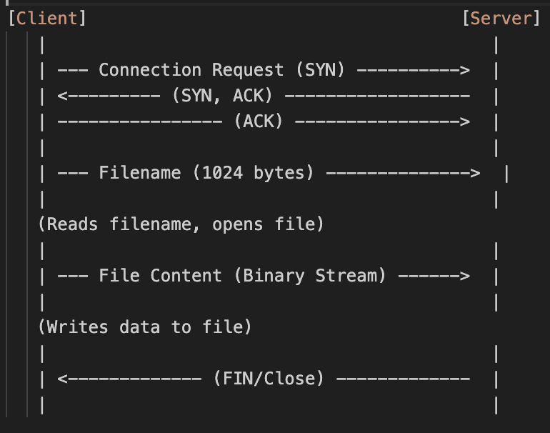

Practical Work 1: TCP File Transfer Report

1. Protocol Design

The protocol is a simple application-level protocol over TCP.


- The client connects to the server.
- The client sends the filename first (fixed 256 bytes buffer).
- The server reads the filename and prepares to write.
- The client sends the file content in chunks.
- The server receives chunks and writes them until the connection is closed or no more data is received.

2. System Organization

The system consists of two main components:

[ File System ] <--- (Read) --- [ Client ] --(Network Socket)---> [ Server ] --- (Write) ---> [ File System ]

- **Server**: 
  - Runs on a machine (localhost for this implementation).
  - Binds to port 8080.
  - Listens for incoming TCP connections.
  - Handles one client at a time (iterative server).

- **Client**:
  - Runs on the same or different machine.
  - Connects to the server's IP (127.0.0.1) and port 8080.
  - Takes a filename as an argument.
  - Reads the file and sends it over the socket.

3. Implementation Details

**Server Implementation (`server.c`):**
The server sets up a socket and waits for a connection.
```c
// Creating socket
if ((server_fd = socket(AF_INET, SOCK_STREAM, 0)) == 0) { ... }

// Binding to port 8080
address.sin_port = htons(PORT);
bind(server_fd, (struct sockaddr *)&address, sizeof(address));

// Listening
listen(server_fd, 3);

// Accepting connection
new_socket = accept(server_fd, (struct sockaddr *)&address, (socklen_t*)&addrlen);

// Reading filename and file content
read(new_socket, filename, 256);
FILE *fp = fopen(filename, "wb");
while ((valread = read(new_socket, buffer, BUFFER_SIZE)) > 0) {
    fwrite(buffer, 1, valread, fp);
}
```

**Client Implementation (`client.c`):**
The client connects to the server and sends data.
```c
// Creating socket
sock = socket(AF_INET, SOCK_STREAM, 0);

// Connecting to server (127.0.0.1:8080)
inet_pton(AF_INET, "127.0.0.1", &serv_addr.sin_addr);
connect(sock, (struct sockaddr *)&serv_addr, sizeof(serv_addr));

// Sending filename
strncpy(filename_buffer, filename, 255);
send(sock, filename_buffer, 256, 0);

// Sending file content
FILE *fp = fopen(filename, "rb");
while ((n = fread(buffer, 1, BUFFER_SIZE, fp)) > 0) {
    send(sock, buffer, n, 0);
}
```

4. Roles

- **Server**: Acts as the receiver. It is responsible for availability (listening) and data persistence (saving the received file).
- **Client**: Acts as the sender. It initiates the transfer and ensures the data from the local disk is pushed to the network.
